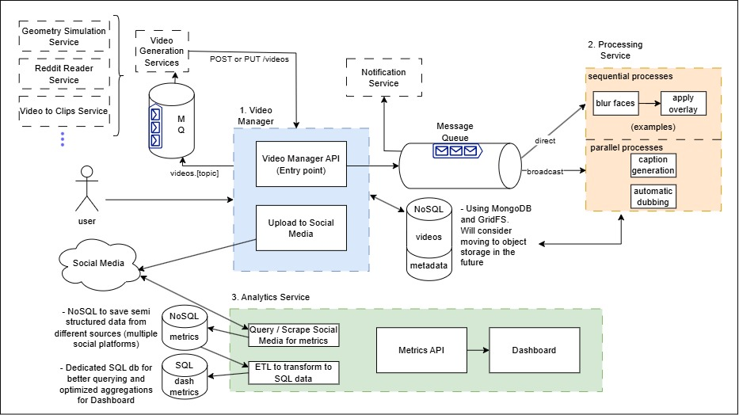

# video-manager
Microservices based project to manage automated video creation, upload, and feedback/analytics.

The manager also adds a "human verification" / "quality assurance" step before the automated upload

Some of the tools / concepts used on this project are:
- Microservices architecture
- Kubernetes
- RabbitMQ
- Asynchronous Processing
- MongoDB (NoSQL)
- Postgresql (SQL)
- SQL Alchemy
- FastAPI
  
---
*All services have READMEs explaining them more in depth*

---

### Architecture
v2 overview:

#### Choices
- **Microservices architecture** works well for the different video generation services, and enables me to scale each service separately
- **videos db (NoSQL MongoDB)** stores video files (using GridFS) and generation parameters / metadata. The parameters have dynamic schemas, that's why a NoSQL database was chosen to store them.
The raw and processed videos stored in the database until the user chooses to edit, delete, or upload them to social media
- **RabbitMQ** is used for messaging. It was chosen for it's routing schemas and the out of the box data persistence. It's currently inside the Kubernetes Cluster, but I may host it outside the cluster in the future.
- The NoSQL database in the analytics service was chosen so it is easy to save all the different data structures from each platform and decide on wich data I will be using later.
- The SQL database in the analytics service was chosen to improve the querying and aggreagation speed for these type of operations usually done in dashboards

- **API library**: For now I am using Flask for the manager API mainly because I was using it to create the pages for the frontend. I decided to move to NiceGUI for the frontend (so it is easy to create it with pure python for now), and may switch to FastAPI for their async support.

---

Earlier versions can be found in: [docs folder](./docs/video-manager-architecture.png)

---

## Project Overview
The project is a tool to manage different automated video creation/processing services.

The main features the project will handle are as follows:

- Request automated video creation (the manager sends a request to one or more generation services via the queue)
- Add video processing steps (handled by the Processing Service)
- Approve for social media upload or scheduled upload
- Do not approve: delete or re-request video generation with different options
- Analytics Service (For future development) aquisition of metrics from multiple platforms and display in a single dashboard

### Program Flow
This is out of date and may be deleted later*
#### Video Creation
1. The user communicates with the API via a single gateway. Depending on the service intended, the user can:
   1. upload a video
   2. Add parameters for video creation
2. The gateway adds the video to the raw video database (mongoDB) and forwards a message to the approppriate queue (RabbitMQ)
3. A receiver in on of the video generation services reads the queue and creates/processes the video. On completion, it:
   1.  deletes the video from raw DB.
   2.  Adds it to the processed videos database
   3.  Forwards a message back to "processed"  queue
4. A receiver in the notifications service receives the message and notifies the user that the video was created

#### Quality Assurance / User feedback
1. The user reviews the video, adds extra information (eg. title, thumbnail) and decides to continue / stop the process
2. The gateway forwards a message to the upload queue
3. The upload service's receiver reads the queue and uploads the video to the social media platform. On completion, it sends a message back to the queue
4. A receiver in the notifications service receives the message and notifies the user that the video was posted