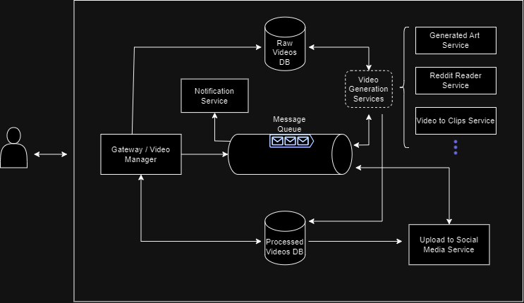

# video-manager
Microservices based project to manage video creation and upload.

This project was created to better manage some automated video creation projects I was developing and add a feedback / quality assurance step to the process.

Some of the tools / concepts used on this project are:
- Microservices architecture
- Kubernetes
- RabbitMQ
- Asynchronous Processing
- MongoDB

## Project Overview

### Architecture

### Program Flow
#### Video Creation
1. The user communicates with the API via a single gateway. Depending on the service intended, the user can:
   1. upload a video
   2. Add parameters for video creation
2. The gateway adds the video to the raw video database (mongoDB) and forwards a message to the approppriate queue (RabbitMQ)
3. A receiver in on of the video generation services reads the queue and creates/processes the video. On completion, it:
   1.  deletes the video from raw DB.
   2.  Adds it to the processed videos database
   3.  Forwards a message back to "processed"  queue
4. A receiver in the notifications service receives the message and notifies the user that the video was created

#### Quality Assurance / User feedback
1. The user reviews the video, adds extra information (eg. title, thumbnail) and decides to continue / stop the process
2. The gateway forwards a message to the upload queue
3. The upload service's receiver reads the queue and uploads the video to the social media platform. On completion, it sends a message back to the queue
4. A receiver in the notifications service receives the message and notifies the user that the video was posted