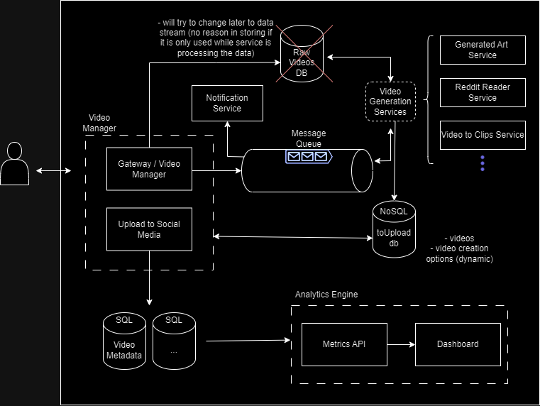

# video-manager
Microservices based project to manage automated video creation and upload to social media.

The manager also adds a "human verification" / "quality assurance" step before the automated upload

In the new version a metrics/analytics API is being added so I can better remember some SqlAlchemy and FastAPI concepts.

Some of the tools / concepts used on this project are:
- Microservices architecture
- Kubernetes
- RabbitMQ
- Asynchronous Processing
- MongoDB (NoSQL)
- Postgresql (SQL)
- SQL Alchemy
- FastAPI
  
---
*All services have READMEs explaining them more in depth*

---

## Project Overview
The project is a tool to manage different automated video creation/processing services.

After the videos are created, we can choose what happens to the video, for example:

- Send it to be uploaded
- Ask for more videos to be generated
- Change generation options and send to be re-created (it's randomized by default)
- Delete generated video

 If the video is sent to be uploaded, it is uploaded to the configured social medias and some metadata is commited to the database

The metadata, along with other data can be used to create dashboards with the Metrics API

### Architecture
v2 overview:

#### Choices
- **Microservices architecture** works well for the different video generation services, and enable me to scale each service separately
- **toUpload db (NoSQL MongoDB)** stores videos files (using GridFS) and generation parameters. The parameters have dynamic schemas, that's why a NoSQL database was chosen to store them
- **raw Videos DB** was used if a video input was needed just because it was easier to implement, but I'm planning on changing it to a **data stream** solution because the data doesn't need to be stored
- **RabbitMQ** is used for messaging. It's currently inside the Kubernetes Cluster, but I may host it outside the cluster in the future.
- The SQL databases and the Metrics API was added in this version so I can remember how to work with **SqlAlchemy and FastAPI** (it's not really needed for the project)

---

v1 can be found in: [docs folder](./docs/video-manager-architecture.png)

---
### Program Flow
Will be updated later*
#### Video Creation
1. The user communicates with the API via a single gateway. Depending on the service intended, the user can:
   1. upload a video
   2. Add parameters for video creation
2. The gateway adds the video to the raw video database (mongoDB) and forwards a message to the approppriate queue (RabbitMQ)
3. A receiver in on of the video generation services reads the queue and creates/processes the video. On completion, it:
   1.  deletes the video from raw DB.
   2.  Adds it to the processed videos database
   3.  Forwards a message back to "processed"  queue
4. A receiver in the notifications service receives the message and notifies the user that the video was created

#### Quality Assurance / User feedback
1. The user reviews the video, adds extra information (eg. title, thumbnail) and decides to continue / stop the process
2. The gateway forwards a message to the upload queue
3. The upload service's receiver reads the queue and uploads the video to the social media platform. On completion, it sends a message back to the queue
4. A receiver in the notifications service receives the message and notifies the user that the video was posted