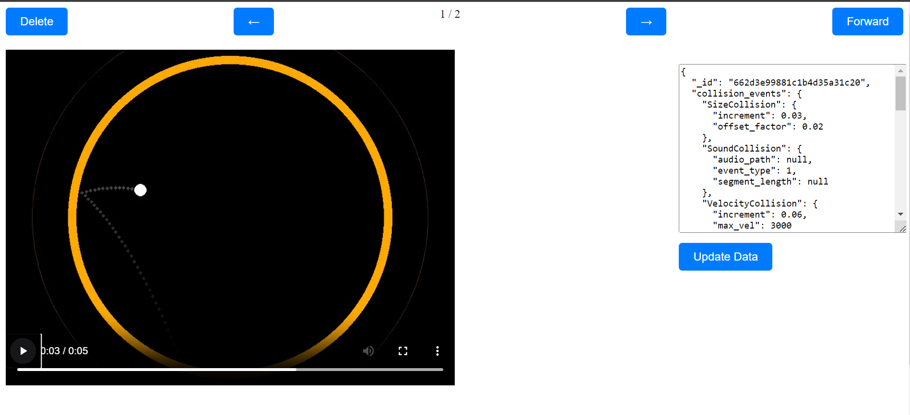

# Video Manager

This is the main service / Api for the system

It handles creation requests and the steps after the video is generated:

- Manage (CRUD) created video
  - View
  - Create video
  - Re-create with different options
  - Delete
  - Accept and forward video to be uploaded
- Upload video to social media
- Save metadata to SQL databases

Management Screen for verson 1 (Some of it may have changed):

